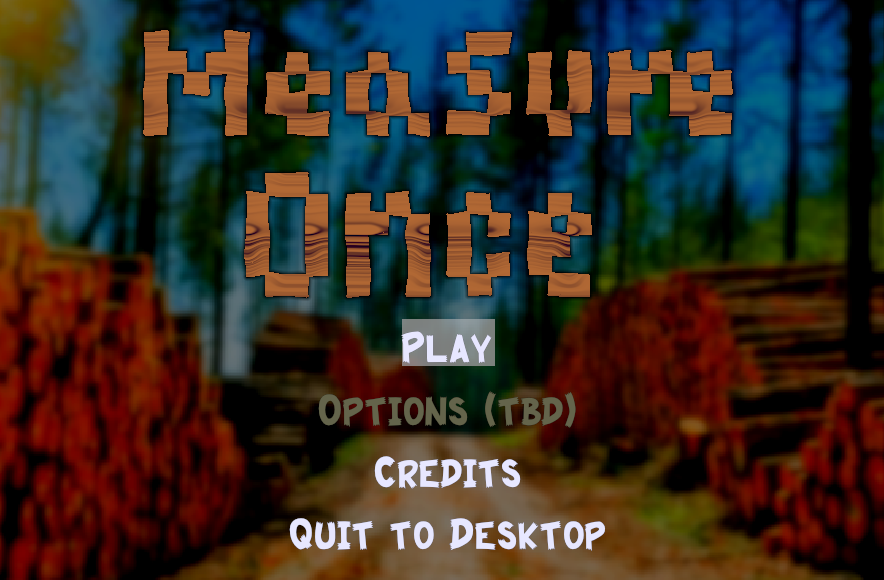

a game where you repair holes by cutting wood to the right shapes.

[download for win32](measure once win32.zip)

[play in browser](./play/index.html)

web version known issues:
- west and north on gamepad seem to be switched. looks like a gilrs issue
- audio causes slowdown on first use. looks like a kira issue

[code](https://github.com/robtfm/bevy_carp)